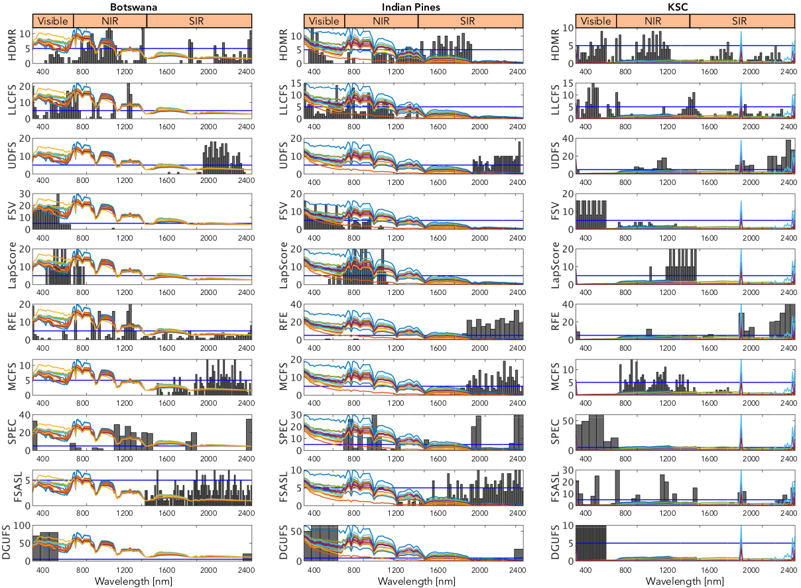

# HDMR4FS - A Scalable Unsupervised Feature Selection  with Orthogonal Graph Representation  for Hyperspectral Images

# Abstract

Feature selection is essential in various fields of science and engineering, from remote sensing to computer vision. Reducing data dimensionality by removing redundant features and selecting the most informative ones improves machine learning algorithms' performance, especially in supervised classification tasks, while lowering storage needs. Graph-embedding techniques have recently been found efficient for feature selection since they preserve the geometric structure of the original feature space while embedding data into a low-dimensional subspace. However, the main drawback is the high computational cost of solving an eigenvalue decomposition problem, especially for large-scale problems. This paper addresses this issue by combining the graph embedding framework and representation theory for a novel feature selection method. Inspired by the high dimensional model representation, the feature transformation is assumed to be a linear combination of a set of univariate orthogonal functions carried out in the graph embedding framework. As a result, an explicit embedding function is created, which can be utilised to embed out-of-samples into low-dimensional space and provide a feature relevance score. The significant contribution of the proposed method is to divide an $n$-dimensional generalised eigenvalue problem into $n$ small-sized eigenvalue problems. With this property, the computational complexity of the graph embedding is significantly reduced, resulting in a scalable feature selection method, which could be easily parallelized too. The performance of the proposed method is compared favourably to its counterparts in high-dimensional hyperspectral image processing in terms of classification accuracy, feature stability, and computational time.

# Results


Histogram plot of the first 25 selected features for each feature selection method over ten different random realisations. The blue horizontal line shows the frequency of selected features above 5

# Data and code availability

Simple code snippets and demos in the /code folder

# How to cite our work

If you find this useful, consider citing our work:

><b>A Scalable Unsupervised Feature Selection  with Orthogonal Graph Representation for Hyperspectral Images</b>
Gulsen Taskin, E. Fatih Yetkin, and Gustau Camps-Valls
Submitted, 2023

```
@article {Taskin23,
  author = {Taskin, G. and Yetkin, E. F. and Camps-Valls, G.},
  title = {A Scalable Unsupervised Feature Selection  with Orthogonal Graph Representation for Hyperspectral Images},
  volume = {},
  number = {},
  year = {2023},
  doi = {},
  publisher = {},
  URL = {},
  journal = {}
}
```
# Acknowledgements
This work was supported by the Scientific and Technological Research Council of Turkey (TÜBITAK)-1001 (Project number: 217E032). Gustau Camps-Valls was supported by the European Research Council (ERC) under the ERC Synergy grant project USMILE (grant agreement 855187).
